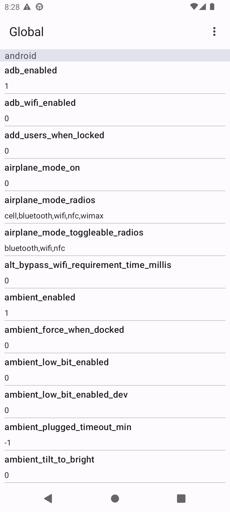

# Config Viewer for Android 12+

The app to quickly check the system settings. It needs root permission. \
Supported files:
- `settings_config.xml`
- `settings_global.xml`
- `settings_secure.xml`
- `settings_system.xml`

# Download
[ConfigViewer-1.0.apk](https://github.com/sdex/ConfigViewer/releases/download/1.0/ConfigViewer-1.0.apk)

|   |    |
|---|---|
|   |    |
|   |    |
